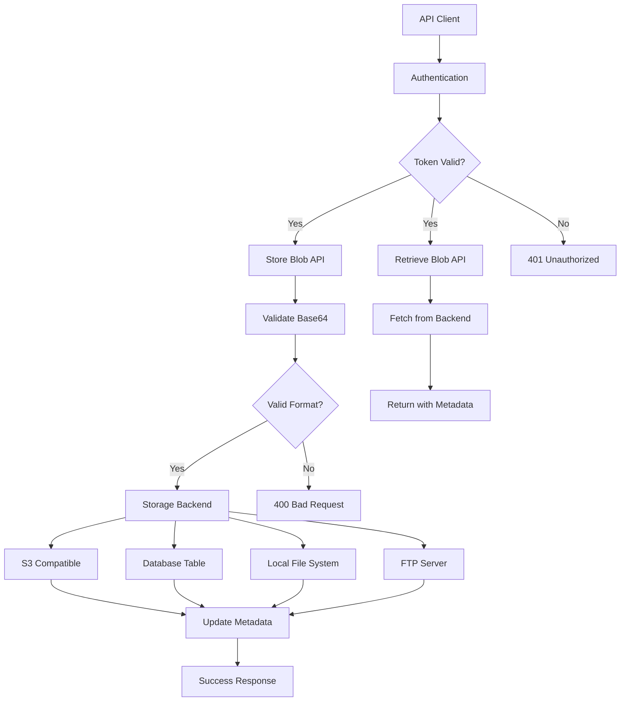

# Rekaz Simple Drive - Product Requirements Document

## 1. Product Overview

Rekaz Simple Drive is a Laravel-based object storage system that provides a unified API interface for storing and retrieving binary data blobs across multiple storage backends. The system serves as an abstraction layer that allows seamless switching between different storage providers while maintaining consistent API endpoints and authentication mechanisms.

The product targets developers and system administrators who need flexible, configurable blob storage with support for various backend services including S3-compatible storage, database tables, local file systems, and FTP servers.

## 2. Core Features

### 2.1 User Roles

| Role | Registration Method | Core Permissions |
|------|---------------------|------------------|
| API Client | Bearer Token Authentication | Can store and retrieve blobs via API endpoints |
| System Administrator | Direct system access | Can configure storage backends and manage system settings |

### 2.2 Feature Module

Our Simple Drive system consists of the following main API endpoints and administrative features:

1. **Blob Storage API**: POST endpoint for storing base64 encoded binary data with unique identifiers
2. **Blob Retrieval API**: GET endpoint for retrieving stored blobs with metadata including size and timestamps
3. **Authentication System**: Bearer token-based authentication for all API requests
4. **Storage Backend Configuration**: Administrative interface for configuring different storage providers
5. **Blob Tracking Dashboard**: Administrative view for monitoring stored blobs and their metadata

### 2.3 Page Details

| Page Name | Module Name | Feature description |
|-----------|-------------|---------------------|
| Blob Storage API | POST /v1/blobs | Accept JSON payload with id and base64 data, validate base64 encoding, store blob in configured backend, return success/error response |
| Blob Retrieval API | GET /v1/blobs/{id} | Retrieve blob by unique identifier, return JSON with id, base64 data, size in bytes, and UTC timestamp |
| Authentication Middleware | Bearer Token Validation | Validate Bearer tokens on all API requests, reject unauthorized access, support configurable token types |
| Storage Backend Manager | Multi-Backend Support | Support S3-compatible storage (HTTP-only), database table storage, local file system, and FTP server (bonus) |
| Blob Metadata Tracker | Database Table Management | Track blob metadata in dedicated database table, store id, size, created_at, storage_backend, and file_path |
| API Documentation | Swagger Integration | Generate comprehensive API documentation with request/response examples and authentication details |
| Unit Testing Suite | Test Coverage | Comprehensive unit and integration tests for all storage backends and API endpoints |

## 3. Core Process

**API Client Flow:**
1. Client obtains Bearer token for authentication
2. Client sends POST request to /v1/blobs with id and base64 encoded data
3. System validates token and base64 data format
4. System stores blob in configured storage backend
5. System records metadata in tracking database
6. Client receives success confirmation
7. Client can retrieve blob using GET /v1/blobs/{id}
8. System returns blob data with metadata

**Administrator Flow:**
1. Administrator configures storage backend (S3, Database, Local FS, or FTP)
2. Administrator sets up authentication tokens
3. Administrator monitors blob storage through tracking dashboard
4. Administrator can switch between storage backends as needed

## 4. User Interface Design

### 4.1 Design Style

- **Primary Colors**: Professional blue (#2563eb) and clean white (#ffffff)
- **Secondary Colors**: Success green (#10b981), warning amber (#f59e0b), error red (#ef4444)
- **Button Style**: Rounded corners with subtle shadows, modern flat design
- **Font**: Inter or system fonts, 14px base size for body text, 16px for headings
- **Layout Style**: Clean REST API responses in JSON format, minimal administrative dashboard
- **Icon Style**: Feather icons or similar minimalist icon set for any UI elements

### 4.2 Page Design Overview

| Page Name | Module Name | UI Elements |
|-----------|-------------|-------------|
| API Documentation | Swagger UI | Clean, interactive documentation with blue accent colors, code examples in dark theme, try-it-now functionality |
| Admin Dashboard | Blob Tracking | Simple table layout with white background, blue headers, pagination controls, search functionality |
| Configuration Panel | Backend Settings | Form-based interface with labeled inputs, dropdown selectors for backend types, validation messages |

### 4.3 Responsiveness

The system is primarily API-focused with minimal web interface. Administrative dashboards should be desktop-first with mobile-adaptive layouts for monitoring purposes. No touch interaction optimization required as this is a backend service.

## 5. Technical Requirements

### 5.1 Storage Backend Specifications

**S3 Compatible Storage:**
- Must use only HTTP client (no S3 libraries allowed)
- Support AWS S3, MinIO, Digital Ocean Spaces, Linode Object Storage
- Implement PUT and GET operations via HTTP requests
- Handle S3 authentication signatures

**Database Table Storage:**
- Separate table from blob metadata tracking
- Store actual blob data as BLOB/LONGBLOB type
- Configurable database connection

**Local File System:**
- Configurable storage directory path
- Organized file structure for blob storage
- Proper file permissions and error handling

**FTP Server (Bonus):**
- Support standard FTP protocol
- Configurable FTP server credentials
- Directory structure management

### 5.2 Authentication Requirements

- Bearer token authentication for all API endpoints
- Configurable token generation and validation
- Simple token management system
- Proper error responses for authentication failures

### 5.3 Testing Requirements

- Unit tests for all storage backend implementations
- Integration tests for API endpoints
- Mock testing for external services (S3, FTP)
- Test coverage reporting
- Automated test execution in CI/CD pipeline